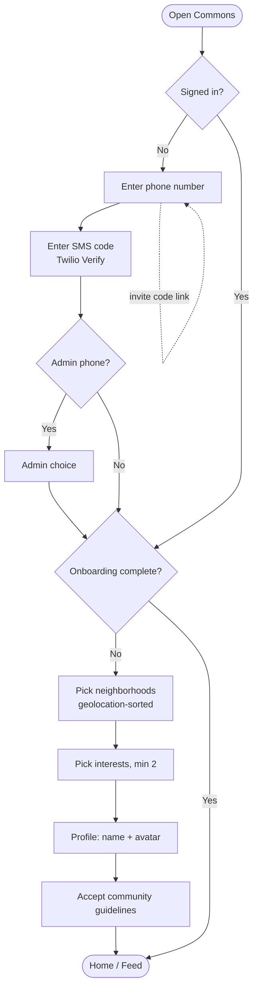
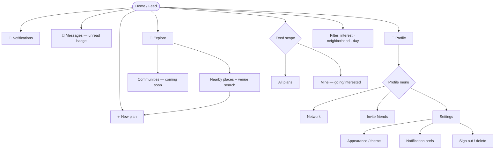
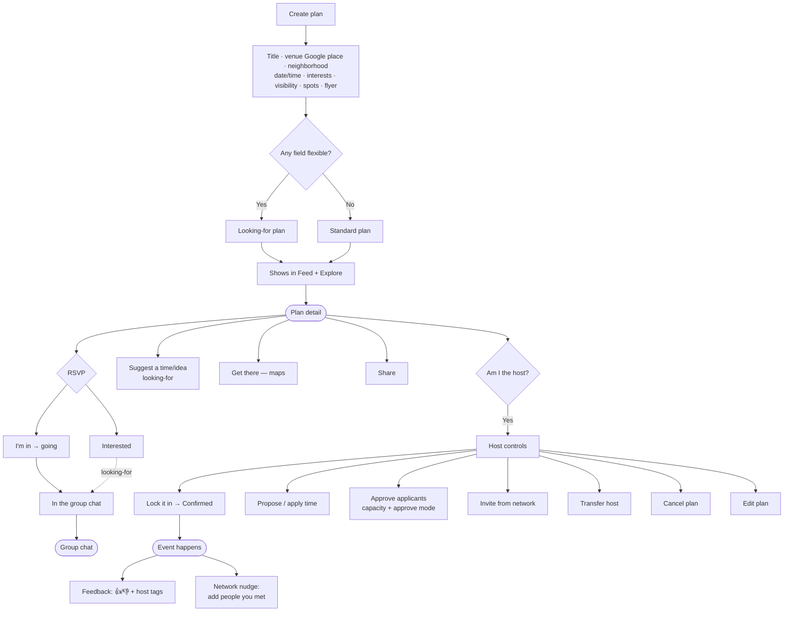
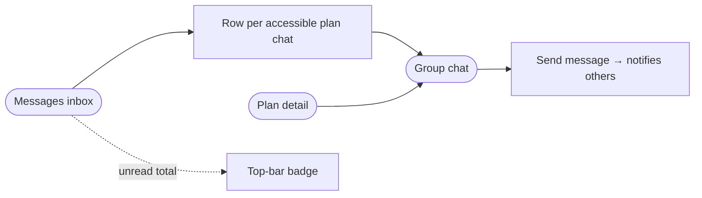
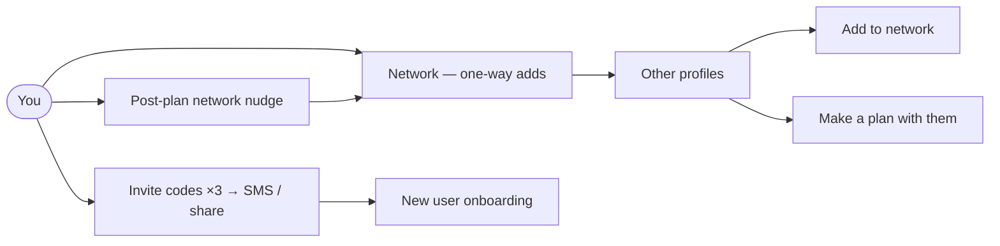

# COMMONS — Core User Flow Map

A map of the existing/core features, grounded in the current `commons-v2` code
(client routes in `App.tsx`, server endpoints under `server/src/routes/*`).

**Legend:** `([ ])` screen · `[ ]` action/state · `{ }` decision · dashed = optional/async.

---

## 1. Entry & Onboarding

Phone-based sign-in (Twilio Verify). Invite codes can be deep-linked
(`/?invite=CODE`) and are prefilled on the phone step.

`POST /api/auth/request-code` · `POST /api/auth/verify-code` ·
`POST /api/auth/redeem-code` · `GET/PATCH /api/auth/me` · `GET /api/neighborhoods`

---

## 2. Main Navigation Shell

Top bar = Notifications + Messages (with unread badge) + Profile.
Bottom nav = Home, the center **+** (new plan), Explore.

`GET /api/plans` · `GET /api/places/nearby|search` · `GET /api/notifications` ·
`GET /api/conversations` · `GET /api/profile/:id`

---

## 3. Plan Lifecycle — the core loop

A plan is "looking-for" when any of date/time/place is left flexible;
otherwise it's a standard plan. Hosts can lock it in to confirm.

`POST /api/plans` · `GET /api/plans/:id` · `PUT/DELETE /api/plans/:id/participation` ·
`POST /api/plans/:id/lock` · `.../propose-time` · `.../apply-time` · `.../approve` ·
`.../invite` · `.../suggestions` · `.../transfer-host` · `.../cancel` · `PATCH /api/plans/:id`

---

## 4. Messaging

Per-plan group chats, plus a unified inbox of every chat you can reach
(hosting / going / interested). In-plan chat still opens from the detail page.

`GET /api/conversations` · `GET /api/plans/:planId/conversation` ·
`GET/POST /api/conversations/:id/messages`

---

## 5. Social graph

`GET /api/auth/network` · `POST /api/auth/friend-add|friend-remove` ·
`GET /api/auth/network-prompt` · `POST /api/auth/network-add|network-dismiss` ·
`GET /api/auth/invite-codes`

---

## Feature summary

| Area | Screen(s) | Core capability |
|---|---|---|
| Auth & onboarding | `/onboarding` | Phone sign-in, neighborhoods, interests, profile, guidelines, invite redemption |
| Feed | `/` | All vs Mine, filter by interest/neighborhood/day, just-posted pin |
| Explore | `/explore` | Nearby places by category, venue search, communities (soon) |
| Create plan | `/plans/new` | Venue picker, flexible toggles → looking-for, visibility, spots, flyer, invite |
| Plan detail | `/plans/:id` | RSVP, roster, host controls, lock-in, time proposals, get-there, share |
| Chat | `/messages`, `/plans/:id/chat` | Unified inbox + per-plan group chat with unread badge |
| Profile | `/profile/:id` | Hero, stats, interests, edit, plans calendar, menu |
| Network / Invite / Settings | `/network` `/invite` `/settings` | Network list, invite codes, theme, notification prefs, account |
| Notifications | `/notifications` | Activity feed, mark read |
| Feedback | post-plan prompt | 👍/👎 + host tags |
| Admin | `/admin` | Summary dashboard (admin phones) |
